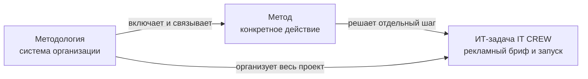

# Лабораторная работа № 1

## Понятия «метод» и «методология» в науке и в решении ИТ-задач

**Студент:** Гарифуллин Искандар Ильданович  
**Группа:** P4108  
**Дата:** 07.09.2026  
**Тема мини-проекта:** веб-прототип платформы для постановки и размещения рекламных задач IT CREW DIGITAL

**Репозиторий:** https://github.com/iskandario/lab1-it-crew-digital  
**Опубликованный MVP:** https://it-crew-digital.okrupashiani.chatgpt.site/

## Цель работы

Сформировать понимание различий между понятиями «метод» и «методология», научиться выбирать их для решения ИТ-задачи и применить выбранную методологию при разработке авторского веб-прототипа для рекламной сферы.

## Задачи работы

1. Рассмотреть не менее семи трактовок понятий «метод» и «методология».
2. Сопоставить понятия по цели, уровню абстракции и области применения.
3. Привести примеры использования методов и методологий в ИТ.
4. Сформулировать рекламную ИТ-задачу и определить границы MVP.
5. Обосновать итерационную методологию и набор методов разработки.
6. Создать и проверить кликабельный веб-прототип IT CREW DIGITAL.

## 1. Теоретическая часть

### 1.1. Рабочее различие понятий

В работе используется следующее рабочее различие. **Метод** — конкретный способ действия, исследования или проверки, применяемый для достижения отдельного результата. **Методология** — система принципов, правил и связанных методов, которая организует весь путь решения задачи и объясняет, почему выбран именно такой порядок действий.

Метод отвечает на вопрос «как выполнить данный шаг?». Методология отвечает на вопросы «какую стратегию выбрать, какие шаги связать между собой и по каким критериям оценить результат?». Например, прототипирование является методом, а итерационная разработка — методологией, в рамках которой прототип несколько раз создаётся, проверяется и улучшается.

### 1.2. Таблица 1 — Трактовки понятий «метод» и «методология»

Формулировки в таблице являются кратким пересказом содержания источников. Они не выдаются за дословные цитаты.

| Источник | Трактовка понятия «метод» | Трактовка понятия «методология» | Особенности трактовки |
|---|---|---|---|
| Философский энциклопедический словарь / под ред. Л. Ф. Ильичёва и др. — М.: Советская энциклопедия, 1983 | Способ теоретического или практического освоения действительности, основанный на упорядоченных приёмах | Учение о методах познания и преобразования действительности | Общефилософский уровень; метод связан с деятельностью, методология — с осмыслением её оснований |
| Рузавин Г. И. «Методология научного исследования» | Организованный путь достижения познавательной цели | Система принципов, норм и способов построения научного исследования | Подчёркнуты логика, обоснованность и нормативность исследования |
| Дрещинский В. А. «Методология научных исследований» | Приём или совокупность действий для получения и проверки знания | Учение о принципах, логике и организации научного поиска | Метод реализует отдельный шаг, методология задаёт общий каркас |
| Москвичева О. С. «Методология диссертационного исследования» | Способ достижения определённого результата в научном познании | Совокупность методов и принципов, образующая структуру исследования | Понятия нельзя смешивать; методология шире отдельного метода. [CyberLeninka](https://cyberleninka.ru/article/n/metodologiya-dissertatsionnogo-issledovaniya-sem-soobrazheniy-dlya-soiskateley) |
| «Методология научных дисциплин документально-коммуникационного комплекса» | Система правил и приёмов изучения явлений и достижения результата | Система организации исследования, объединяющая методы разных дисциплин | Выделена интегрирующая функция методологии. [CyberLeninka](https://cyberleninka.ru/article/n/metodologiya-nauchnyh-distsiplin-dokumentalno-kommunikatsionnogo-kompleksa) |
| ISO 9241-210:2019 | Отдельной практикой может быть наблюдение, интервью или проверка удобства интерфейса | Человеко-ориентированный подход, организующий проектирование вокруг потребностей пользователя | Пример ИТ-методологии жизненного цикла; [ISO](https://www.iso.org/standard/77520.html) |
| Agile Manifesto | Конкретная практика разработки: короткая итерация, демонстрация или обратная связь | Система ценностей и принципов, направляющая разработку в условиях изменений | Методология задаёт приоритеты, но не заменяет все процедуры; [Agile Manifesto](https://agilemanifesto.org/iso/ru/manifesto.html) |
| The Scrum Guide, 2020 | Планирование, обзор, ретроспектива и ежедневная синхронизация могут выступать отдельными методами работы | Scrum задаёт лёгкий каркас ролей, событий и артефактов для создания ценности | ИТ-пример методологии, объединяющей организационные методы; [Scrum Guide](https://scrumguides.org/scrum-guide.html) |

**Вывод по таблице.** Метод является конкретным способом действия или исследования, а методология организует несколько методов в целостную систему. В философском понимании методология преимущественно осмысливает основания познания, в научном — задаёт логику и нормы исследования, в ИТ — ещё и управляет жизненным циклом продукта. Поэтому методология не является синонимом метода: она определяет контекст, последовательность и критерии применения методов.

## 2. Сопоставление и классификация

Схема также сохранена отдельным файлом [`docs/mindmap.svg`](docs/mindmap.svg).



| Критерий | Метод | Методология |
|---|---|---|
| Цель | Получить частный результат | Организовать весь процесс решения |
| Уровень | Операционный | Стратегический и организационный |
| Объект | Один этап или процедура | Проект, исследование или жизненный цикл |
| Примеры | анализ требований, прототип, тестирование | итерационная разработка, Agile, Scrum, HCD |
| Проверка | Выполнен ли конкретный шаг | Соответствует ли весь процесс цели и ограничениям |

### Примеры применения в ИТ

1. **Анализ требований + итерационная разработка.** Команда фиксирует, что рекламодателю нужны цель, аудитория, бюджет и срок, затем уточняет поля после показа прототипа.
2. **Декомпозиция + Agile.** Задача «запустить рекламу» разбивается на бриф, поиск каналов, получение предложений, выбор партнёра, публикацию и аналитику.
3. **Use-case моделирование + Scrum.** Сценарии «создать задачу», «сравнить предложения» и «закрыть сделку» превращаются в понятные элементы backlog.
4. **Наблюдение и интервью + человеко-ориентированное проектирование.** Изучаются реальные затруднения заказчика, который не умеет сформулировать рекламную задачу.
5. **Прототипирование + итерационная методология.** До разработки полноценного backend создаётся кликабельная форма, позволяющая проверить структуру брифа.
6. **Функциональное тестирование + любой жизненный цикл.** Проверяется, что форма открывается, обязательные поля принимаются, новая задача появляется в списке, а данные сохраняются.

## 3. Практическая часть: IT CREW DIGITAL

### 3.1. Описание проблемы

Рынок digital-услуг часто начинается с некачественно сформулированного запроса: «нужна реклама». В таком запросе не хватает цели, аудитории, бюджета, сроков и ожидаемого результата. Из-за этого предложения исполнителей трудно сравнивать, а заказчик теряет контекст при переходе между каналами общения.

IT CREW DIGITAL решает эту проблему как MVP платформы: помогает описать рекламную задачу, показывает открытые кампании и объясняет путь от брифа до результата. На опубликованном сайте представлены четыре стадии: **бриф → предложения → сделка → результат**. Для полноценной сделки пользовательский контакт передаётся в Telegram, поэтому текущую версию корректно называть веб-прототипом, а не готовой биржей с полноценной серверной частью.

### 3.2. Целевая аудитория и пользователи

**Основной пользователь — рекламодатель:** предприниматель, бренд или небольшая команда, которым нужно запустить продвижение и получить сопоставимые предложения.

**Второй пользователь — digital-команда или исполнитель:** агентство, блогер, специалист по трафику или разработчик, который хочет отвечать на сформулированные задачи.

### 3.3. Границы MVP

В MVP включены:

- презентация ценности платформы;
- объяснение четырёх этапов работы;
- список открытых рекламных задач;
- форма размещения новой задачи;
- поля цели, канала, бюджета, срока и аудитории;
- локальное сохранение созданных задач;
- переход к контакту с командой.

В MVP не входят авторизация, настоящая база данных, платёжный модуль, рейтинги исполнителей и серверная аналитика. Эти функции являются следующим этапом развития и сознательно исключены, чтобы сохранить учебный прототип управляемым.

### 3.4. Выбор методологии

Выбрана **итерационная методология**. Для рекламной платформы она подходит по трём причинам:

1. формулировки брифа уточняются после обратной связи от рекламодателей;
2. интерфейс можно проверять ещё до появления сложного backend;
3. каждая итерация даёт рабочий результат, а не только документы.

Пример итераций:

| Итерация | Содержание | Проверяемый результат |
|---|---|---|
| 1 | Сформулировать проблему и роли пользователей | понятная постановка задачи |
| 2 | Собрать структуру «бриф → предложения → сделка → результат» | карта пользовательского пути |
| 3 | Сделать лендинг и карточки кампаний | пользователь понимает ценность MVP |
| 4 | Добавить форму размещения задачи | заказчик может создать бриф |
| 5 | Проверить сценарии и ограничения | найденные ошибки и список улучшений |

### 3.5. Методы, применённые на этапах

| Этап | Метод | Обоснование | Результат |
|---|---|---|---|
| Исследование проблемы | анализ требований | позволяет отделить реальную боль от лишних функций | требования к брифу |
| Планирование | декомпозиция | большая рекламная задача разбивается на понятные этапы | backlog и MVP-границы |
| Проектирование | use-case моделирование | показывает действия рекламодателя и исполнителя | пользовательский путь |
| Интерфейс | прототипирование и HCD | позволяет проверить понятность до backend | лендинг, форма, карточки |
| Реализация | компонентное проектирование | разделяет секции сайта и упрощает развитие | HTML/CSS/JS-модули |
| Проверка | функциональное тестирование | проверяет основные сценарии | smoke-тесты и ручной сценарий |
| Улучшение | эвристическая оценка | помогает найти непонятные названия и лишние шаги | список UI-улучшений |

### 3.6. Архитектура прототипа

Прототип построен как статическое веб-приложение из трёх слоёв:

- **представление:** `index.html` содержит hero-блок, этапы, карточки задач и модальное окно брифа;
- **стиль:** `styles.css` отвечает за визуальную иерархию, сетку, тёмно-синюю палитру и адаптивность;
- **поведение:** `app.js` открывает форму, создаёт карточку, обновляет список, сохраняет данные в `localStorage` и показывает уведомление.

Такое решение соответствует MVP: нет затрат на сервер, но основной пользовательский сценарий можно проверить в браузере.

### 3.7. Пользовательский сценарий

1. Пользователь открывает платформу и видит, какую проблему она решает.
2. Переходит к открытым задачам и знакомится с форматом кампаний.
3. Нажимает «разместить задачу».
4. Заполняет название, цель, канал, бюджет, срок и аудиторию.
5. Нажимает «опубликовать задачу».
6. Новая задача появляется первой в списке.
7. После перезагрузки локально сохранённая задача остаётся в списке.

### 3.8. Тестирование

Проверены следующие сценарии:

| № | Проверка | Ожидаемый результат |
|---|---|---|
| 1 | Открытие главной страницы | отображаются hero, этапы и открытые задачи |
| 2 | Открытие формы | появляется модальное окно с полями брифа |
| 3 | Отправка формы | новая карточка добавляется в начало списка |
| 4 | Обязательные поля | браузер не отправляет пустое название или аудиторию |
| 5 | Перезагрузка страницы | созданная задача восстанавливается из `localStorage` |
| 6 | Мобильный экран | блоки перестраиваются в одну колонку |
| 7 | Автотест | проверяются ключевые элементы HTML, JS, README и SVG |

Автоматический тест запускается командой:

```bash
npm test
```

## 4. Ограничения и дальнейшее развитие

Главное ограничение — отсутствие backend: данные новой задачи хранятся только в браузере и не видны другим пользователям. Также предложения исполнителей представлены демонстрационными карточками, а не результатом настоящего поиска. Для следующей итерации потребуются API, база данных, авторизация, роли пользователей, модерация, уведомления и аналитика кампаний. Эти ограничения не противоречат цели лабораторной, потому что работа посвящена прототипу и выбору методологии, а не промышленной эксплуатации сервиса.

## 5. Выводы

В работе были рассмотрены трактовки понятий «метод» и «методология» на общефилософском, научном и ИТ-уровнях. Метод представляет собой конкретный приём или способ действия, а методология объединяет методы и задаёт логику их применения. Для рекламной ИТ-задачи выбрана итерационная методология, потому что требования и содержание брифа удобно уточнять через короткие циклы обратной связи. На практике были применены анализ требований, декомпозиция, use-case моделирование, прототипирование, человеко-ориентированное проектирование и тестирование. В результате создан MVP IT CREW DIGITAL, который показывает путь от рекламного брифа до запуска кампании и содержит рабочую форму размещения задачи. Практическая часть показала, что методология помогает не просто перечислить методы, а связать их в последовательный процесс разработки. Полноценная версия потребовала бы backend и реальных ролей пользователей, однако для учебного прототипа выбранный объём является достаточным и обоснованным.

## Список использованных источников

Описания составлены с учётом общих требований ГОСТ Р 7.0.100–2018. Перед сдачей рекомендуется сверить оформление с методическими указаниями преподавателя.

1. Философский энциклопедический словарь / гл. ред. Л. Ф. Ильичёв [и др.]. — Москва : Советская энциклопедия, 1983. — 840 с.
2. Рузавин, Г. И. Методология научного исследования : учебное пособие. — Москва : ЮНИТИ-ДАНА, 1999.
3. Дрещинский, В. А. Методология научных исследований : учебник для вузов. — 2-е изд., перераб. и доп. — Москва : Юрайт, 2021. — 274 с. — URL: https://urait.ru/bcode/472413 (дата обращения: 07.09.2026).
4. Москвичева, О. С. Методология диссертационного исследования (семь соображений для соискателей) // КиберЛенинка. — URL: https://cyberleninka.ru/article/n/metodologiya-dissertatsionnogo-issledovaniya-sem-soobrazheniy-dlya-soiskateley (дата обращения: 07.09.2026).
5. Методология научных дисциплин документально-коммуникационного комплекса // КиберЛенинка. — URL: https://cyberleninka.ru/article/n/metodologiya-nauchnyh-distsiplin-dokumentalno-kommunikatsionnogo-kompleksa (дата обращения: 07.09.2026).
6. ISO 9241-210:2019. Ergonomics of human-system interaction — Part 210: Human-centred design for interactive systems. — Geneva : International Organization for Standardization, 2019. — URL: https://www.iso.org/standard/77520.html (дата обращения: 07.09.2026).
7. Манифест гибкой разработки программного обеспечения. — URL: https://agilemanifesto.org/iso/ru/manifesto.html (дата обращения: 07.09.2026).
8. Schwaber, K.; Sutherland, J. The Scrum Guide: The Definitive Guide to Scrum: The Rules of the Game. — 2020. — URL: https://scrumguides.org/scrum-guide.html (дата обращения: 07.09.2026).
9. ГОСТ Р 7.0.100–2018. Система стандартов по информации, библиотечному и издательскому делу. Библиографическая запись. Библиографическое описание. Общие требования и правила составления. — URL: https://docs.cntd.ru/document/1200161674 (дата обращения: 07.09.2026).
